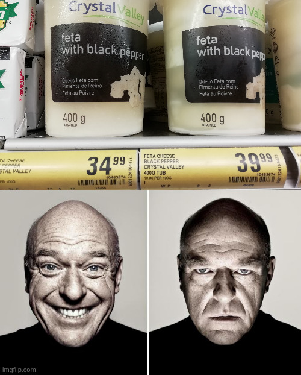
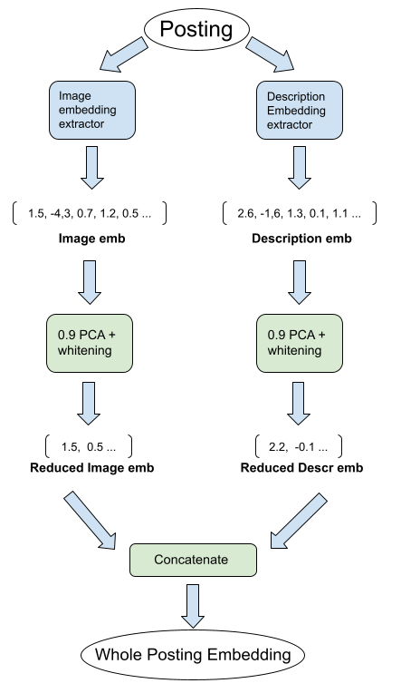
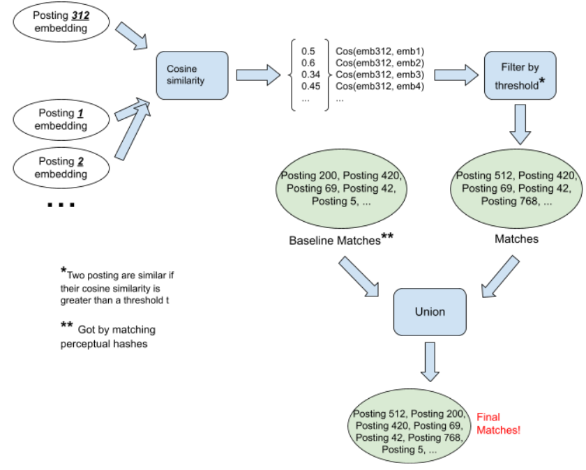
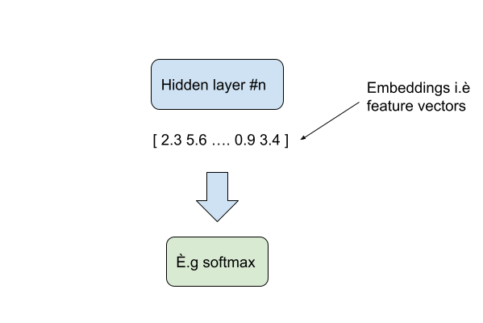
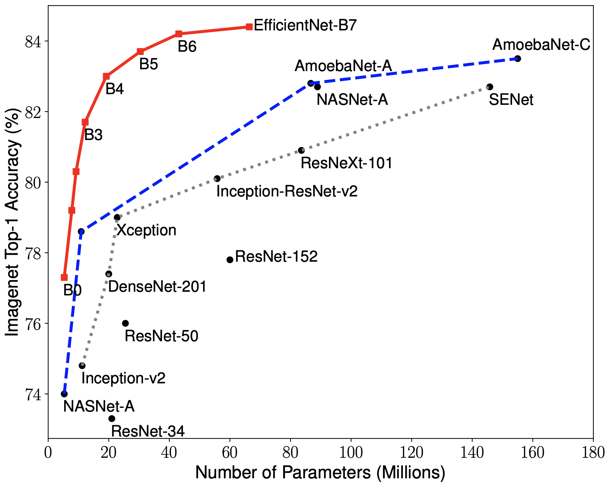
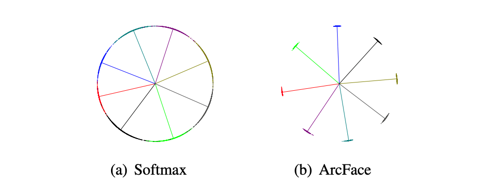
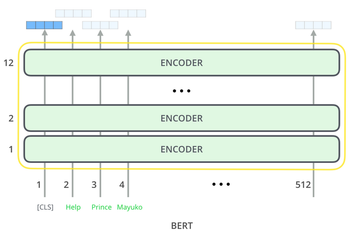

# *Shopee* **Price Police**

<i>How to detect if two products are the same by their images and descriptions with the help of embeddings.</i>

<b>Jesse Dingley & Joonas Järve</b>

<div style="text-align:center"></div>

## Background & Task

Do you love a good deal and don't like being scammed into spending more than you need to ? Then you've come to the right place. Kaggle held a competition throughout a few months of 2021: <i>Shopee - Price Match Guarantee</i> [see here](https://www.kaggle.com/c/shopee-product-matching/overview). More than 2000 teams participated but only three came out victorious and with a fatter wallet. This competition was hosted by Shopee [see here](https://shopee.com/), the leading e-commerce platform in Southeast Asia and Taiwan. Their goal is to filter out matching products at higher prices to ensure the best possible customer experience.

Our team, the <i>Shopee Price Police</i> took part in this competition as a part of the neural networks course project at the University of Tartu in Estonia. We're definetly not grandmasters of Deep Learning (yet) but nevertheless we study a few interesting approaches to this problem. 

## Data

As this being a Kaggle competition, we were treated to very well organised and freely avaiable data. So what exactly did Shopee provide us with to crack on with the task?

Made available for training was a set of 34250 postings. Each posting has the following attributes:
  - posting ID
  - product image
  - perceptual hash of the product image
  - product description
  - ID code for all postings that map to the same product *<i><b>not made available for test set</b></i>
  
Note that there are 11 014 unique ID codes for all postings that map to the same product.
  
For those wondering, perceptual hashing creates a "fingerprint" of some multimedia item, in this case: images. Perceptual hashes act like embeddings representing the features of the image in question. An example hash might be `b94cb00ed3e50f78`. So if two postings have the same perceptual hash, we can essentially consider these postings of showing the same product. [See here](https://en.wikipedia.org/wiki/Perceptual_hashing) for more information.

In untypical fashion, the test set is bigger than the train set, at around 60 000 examples! We usually see much smaller test sets but we can assume Shopee wants to ensure the proposed approaches will also work very well when deployed in real life. Testing on a small test set might overvalue some models. Testing on larger sets tests to see if the models can perform well when dealing with a wider range of different postings.

And of course in typical Kaggle fashion, the test set is hidden. Because otherwise we might be seeing scores close to 100% 😅 


## Masterplan

<b><u>General Approach / Pipeline :</u></b> It's first best to explain our general approach to the problem at hand. For each posting we start by contructing an embedding for the whole posting, combining image and text (posting description). Here is a diagram explaining the situation because let's be honest diagrams are just better than textual descriptions.

<div style="text-align:center"></div>

Once we have our embeddings for each posting we can proceed onto matching them. The following diagram show how to determine all matches for a posting. In this example we're matching all similar postings to posting 312.

<div style="text-align:center"></div>

The previous diagrams simply present our pipeline for finding similar products and well you might now be asking yourselves <b>hOw dO wE ExTrAcT tHeSe "EmBedDiNgS"??</b>. This is where the fun begins and Deep Learning finally arrives into the picture. In the next parts of this blog we explore how we extract the image and text embeddings with help from neural networks.  

### Images

<b><u>Quick recap of Feature / Embedding extraction</u></b>
<br>
Firstly, let's dig into the process of extracting image embeddings. Let's just assume that we have some kind of neural network (NN) model $X$. The main idea behind feature extraction lays in the very essence of the NNs themselves. Each layer of the network will learn to represent new features of the input. So, at the very end, before the output unit, we should have the input represented in the best form for the task model $X$ is trained. This is the place if we want to get the input's best representation for the task, where we take those representations i.e embeddings or sometimes called feature vectors of the input. In other words we get the embeddings just after the last hidden layer.

<div style="text-align:center"></div>

Let's get more precise now. We tried out two major image classification models:

- EfficientNetB0
- EfficientNetB3
- fine-tuned EfficientNetB3 

<b><u>EfficientNet</u></b>

EfficientNet was first introduced by [Tan and Le, 2019](https://arxiv.org/abs/1905.11946) and is one of the most efficient models that reaches state-of-art accuracy on the *imagenet* tasks. We used the *Keras* implementation of EfficientNet.

<div style="text-align:center"></div>

We can see from the [source](https://github.com/tensorflow/tpu/blob/master/models/official/efficientnet/g3doc/params.png) graph that B0 has the least parameters and worst accuracy but B7 is the biggest model with the best accuracy as well. So, as bigger models take more resources we decided to start small i.e. with the B0 model. Then, as we made it work, moved on to B3. 

Firstly, we did not fine-tune but tried to get the whole pipeline in place: to create the baseline notebook that loads the images, creates the embeddings and predicts the matches. So, we loaded the `EfficientNetB0` with *imagenet* weights.

```
from efficientnet.tfkeras import EfficientNetB0
model = EfficientNetB0(weights='imagenet', include_top=False, pooling="max")
```
After we had succeeded in this, we felt tempted to try out bigger models. So, we tried `EfficientNetB3`. This, unfortunately, did not provide any better accuracy. Potentially it should have better accuracy and we decided to continue developing with B3 model. 

<b><u>PCA i.e. Principal Component Analysis</u></b>

One thing that was really bothering us, was the slight touch of overfitting at every submission and the possible overcomplication of the embeddings. As B0 net embeddings were of size of 1280 and B3 already 1536, it seemed like a possible area of improvement. The regularization that proved best and was fastest, was PCA i.e. Principal Component Analysis. We set the PCA to output a number of components so that the result would explain 75% or 90% of the variance among the inputted embeddings. The PCA has a nice attribute `whiten` as well. This ensures uncorrelated outputs with unit component-wise variances which improved our model even more.

<b><u>Arcface i.e Additive Angular Margin Loss </u></b>

Obviously, we want the similar postings' embeddings to be close to each other in relation to cosine similarity and dissimilar ones to be far from each other in the vector space. Therefore, instead of classic softmax, Additive Angular Margin Loss is the solution. Arcface was first introduced in the paper [ArcFace: Additive Angular Margin Loss for Deep Face Recognition](https://arxiv.org/pdf/1801.07698v3.pdf)[[1]](#1). It will add an angular margin penalty between the weights and input, so to force the distance between dissimilar classes to be larger. The figure below illustrates it (figure is from [[1]](#1)):

<div style="text-align:center"></div>

The class `ArcMarginProduct` that was used in our solution was adapted from [ragnar's notebook](https://www.kaggle.com/rooben/img-baseline?scriptVersionId=63066660).

<b><u>EfficientNetB3 and fine-tuning it</u></b>

Fine-tuning the weights had to be tried out. We did it twice: first time we overfitted too much and the result did not improve. Second time, the stopping of the training was more on point and the results were impressive. The fine-tuning was done using the ArcFace loss and was set up as a classification task with 11 014 classes.

<b><u>Results</u></b>

After all the different approaches and strategies with image embeddings, here is the summary of the mean F1 scores (on training data) using optimal thresholds.

<table class="tg center">
<thead>
  <tr>
    <th class="tg-0pky"></th>
    <th class="tg-0pky">Mean F1-score</th>
  </tr>
</thead>
<tbody>
  <tr>
    <td class="tg-btxf">EfficientNetB0</td>
    <td class="tg-btxf">67%<br></td>
  </tr>
  <tr>
    <td class="tg-0pky">EfficientNetB3</td>
    <td class="tg-0pky">67%</td>
  </tr>
  <tr>
    <td class="tg-btxf">EfficientNetB0 + PCA</td>
    <td class="tg-btxf">68.7%</td>
  </tr>
  <tr>
    <td class="tg-0pky">B3 + ArcFace</td>
    <td class="tg-0pky">67.5%</td>
  </tr>
  <tr>
    <td class="tg-0pky">fine-tuned B3 + ArcFace + PCA</td>
    <td class="tg-0pky">79%</td>
  </tr>
  <tr>
    <td class="tg-0pky">fine-tuned v2 B3 + ArcFace + PCA</td>
    <td class="tg-0pky">86.8%</td>
  </tr>
</tbody>
</table>

We can see that fine-tuning eventually got us a remarkable leap in scores and that PCA was now part of the deafault package 😃. 

<b><u>Major time waster i.e. how to build a fast data loading pipeline</u></b>

One thing that really hindered our process was the speed of data loading. Every time we wanted to run our notebooks, we had to load the images. It was super time consuming: on average it took 40 minutes every time to load all the training images- 40 minutes spent staring straight at a wall. Our loading pipeline seemed good and no obvious thing would have made it faster. One solution, that was widely used by other participants, was to use TFRecords. "The TFRecord format is a simple format for storing a sequence of binary records" as stated in [Tensorflow homepage](https://www.tensorflow.org/tutorials/load_data/tfrecord). This would vanish the issue of import speed but in case of test data- it would not help us- we would still need to use the ordinary pipeline as the data will be given as images. After checking out some open notebooks, it occured that the popular solution was to use batches of images instead of calculating the embeddings for each image separately 😏.

A takeway: **Use batches!** - a great helper in that case is a `tf.data.Dataset` class.

### Text

The second major part to solving the problem is dealing with the product descriptions. It's nice having the image embeddings but using description embeddings can also help us in finding similar postings. Two postings with similar descriptions are likely to represent the same product. We tried many approaches to extract description embeddings:
  - fine-tuned BERT
  - Just BERT
  - TF-IDF (#underrated)
  - Doc2Vec

We won't cover each point extensively, but we'll explore in detail the most interesting approaches (BERT and fine-tuned BERT). Don't worry we will also touch upon the other approaches 😅.

<b><u>BERT & fine-tuning BERT</u></b> 
<br>
Now some of you may not know what BERT is or what it can do so here's a brief overview of BERT-like models.

BERT is a pre-trained language model (PLM) (or language representation model). PLMs are models trained in an unsupervised fashion on huge amounts of text by predicting masked words in sentences (and sometimes next sentence prediction - which is the case for BERT). These models learn to understand and represent language. A common architecture used today is the transformer architecture that uses the attention mechanism. As the model processes each word of the input sequence, attention allows the model to look at other words in the input sequence for clues that can help lead to a better encoding (or representation) for this word. The BERT architecture follows the following scheme (a stack of encoders- each encoder consisting of an attention mechanism layer a linear layer) [source](http://jalammar.github.io/illustrated-bert/)

<div style="text-align:center"></div>

So BERT takes as input a sequence and outputs:
  - a contextualized embedding that represents the whole sequence 
  - contextualized embeddings for each separate token.

So one approach to extracting description embeddings is to simply pass each description through BERT and get an embedding (of length 768).

Another but more interesting approach is to fine-tune BERT on our training data. Now the useful thing about PLMs is that they can be fine-tuned to any supervised learning task end-to-end. Meaning we can alter and hence "fine-tune" the pre-trained weights of BERT to teach BERT to be more accustomed to our data, to grasp a better understanding of the data at hand. BERT was pre-trained on wikipedia-like data and our data is messy descriptions: Theoretically, BERT alone won't understand the descriptions very well and won't get us optimal embeddings without fine-tuning.

So now you must be begging to know what task we fine-tuned BERT on ? Well idk lol
<br>
**Joonas take over here plz**

...

As mentioned we also try two other models: TF-IDF and Word2Vec. These two model do not take attention and context into account and are much smaller than BERT but nevertheless they still produce great results and are much more efficient (🚨#spoiler🚨 but Doc2Vec did the worst).


<b><u>TF-IDF</u></b> 
<br>
TF-IDF is a purely <b>statistical</b> approach. TF-IDF evaluates how relevant a word is to a document in a collection of documents. This is done by multiplying two metrics: how many times a word appears in a document (TF), and the inverse document frequency of the word across a set of documents (IDF).


<b><u>Doc2Vec</u></b> 
<br>
Doc2vec is another neural approach to embeddings. It is based of and (very) similar to the famous Word2Vec model. To give a brief overview, Word2vec models train a simple neural net with one hidden layer to predict the next word in a sequence. Word2Vec is <b>NOT</b> contextual: there is only one unique embedding for each word in the vocabulary, full stop, unlike BERT where a word embedding depends on the other words around it. Doc2Vec is basically the same as Word2Vec with the only difference being a paragraph matrix added to the input. In practice we train a Doc2vec model on our training data.

<b><u>Some (interesting but somewhat concerning 😐) results</u></b> 
<br>

Here is a summary of the mean F1 scores (on training data) for each textual model (<b>without</b> concatenation with image embeddings) using optimal threshold:


<style type="text/css">
.center {margin-left: auto; margin-right: auto;}
.tg  {border:none;border-collapse:collapse;border-color:#ccc;border-spacing:0;}
.tg td{background-color:#fff;border-color:#ccc;border-style:solid;border-width:0px;color:#333;
  font-family:Arial, sans-serif;font-size:14px;overflow:hidden;padding:10px 5px;word-break:normal;}
.tg th{background-color:#f0f0f0;border-color:#ccc;border-style:solid;border-width:0px;color:#333;
  font-family:Arial, sans-serif;font-size:14px;font-weight:normal;overflow:hidden;padding:10px 5px;word-break:normal;}
.tg .tg-0pky{border-color:inherit;text-align:left;vertical-align:top}
.tg .tg-btxf{background-color:#f9f9f9;border-color:inherit;text-align:left;vertical-align:top}
</style>


<table class="tg center">
<thead>
  <tr>
    <th class="tg-0pky"></th>
    <th class="tg-0pky">Mean F1-score</th>
  </tr>
</thead>
<tbody>
  <tr>
    <td class="tg-btxf">Fine-tuned BERT</td>
    <td class="tg-btxf">59%<br></td>
  </tr>
  <tr>
    <td class="tg-0pky">Just BERT</td>
    <td class="tg-0pky">59%</td>
  </tr>
  <tr>
    <td class="tg-btxf">TF-IDF</td>
    <td class="tg-btxf"><b>62%</b></td>
  </tr>
  <tr>
    <td class="tg-0pky">Doc2Vec</td>
    <td class="tg-0pky">57%</td>
  </tr>
</tbody>
</table>

Here is a summary of the mean F1 scores (on training data) for each textual model (<b>with</b> concatenation with image embeddings) using optimal threshold:

<table class="tg center">
<thead>
  <tr>
    <th class="tg-0pky"></th>
    <th class="tg-0pky">Mean F1-score</th>
  </tr>
</thead>
<tbody>
  <tr>
    <td class="tg-btxf">Fine-tuned BERT</td>
    <td class="tg-btxf">85.1%<br></td>
  </tr>
  <tr>
    <td class="tg-0pky">Just BERT</td>
    <td class="tg-0pky"><b>85.4%</b></td>
  </tr>
  <tr>
    <td class="tg-btxf">TF-IDF</td>
    <td class="tg-btxf">84.8%</td>
  </tr>
  <tr>
    <td class="tg-0pky">Doc2Vec</td>
    <td class="tg-0pky">83%</td>
  </tr>
</tbody>
</table>

<b>Now just hold on before you start doubting the power and effectiveness of BERT 🚨</b>. As we can see, when using only the language models for matching, TF-IDF comes out on top 🤯 ! By a margin of 3%: a small but not insignificant difference between the BERT models (we can leave Doc2Vec out of the discussion at this point now).

This suggests two things:
  1. Never understimate the power of smaller simpler approaches such as TF-IDF. They deliver surprisingly good results!
  2. Even when fine-tuned on the product descriptions, BERT still has a tough time grasping these short messy descriptions. This suggests BERT should be left to deal with "classical" language (proper sentences). A statistical approach seems to fit this problem better.

Looking at the results when concatenating image and text embeddings, un-fine-tuned BERT comes out on top with a very small margin of 0.3% over fine-tuned BERT. The margins aren't huge between all four models (maximum 2%). 

We can form a few hypotheses from all these results.
  - Textual information doesn't help much in matching products (only improves the F1 score by 1% (note that when only using image models we get F1 of 84.0%)) 
  - We weren't combining the two embeddings together in the right way (we used concatenation)
  - We used the wrong models
  - we didn't fine-tune BERT in the right way or for long enough
  
## Results

Eventually, after finally getting more or less decent results with text and image embeddings, we concatenated them and optimised the threshold. In the following, we will give an improvement timeline:

<table class="tg center">
<thead>
  <tr>
    <th class="tg-0pky">Strategy </th>
    <th class="tg-0pky">Test mean F1-score </th>
  </tr>
</thead>
<tbody>
  <tr>
    <td class="tg-btxf">baseline</td>
    <td class="tg-btxf">0.458<br></td>
  </tr>
  <tr>
    <td class="tg-0pky">BERT</td>
    <td class="tg-0pky">0.487</td>
  </tr>
  <tr>
    <td class="tg-btxf">BERT fine-tuned v1</td>
    <td class="tg-btxf">0.495</td>
  </tr>
  <tr>
    <td class="tg-0pky">Phash </td>
    <td class="tg-0pky">0.548</td>
  </tr>
    <tr>
    <td class="tg-0pky">TF-IDF + Phash</td>
    <td class="tg-0pky">0.580</td>
  </tr>
  <tr>
    <td class="tg-0pky">BERT fine-tuned v1 + Phash</td>
    <td class="tg-0pky">0.580</td>
  </tr>
  <tr>
    <td class="tg-0pky">BERT fine-tuned v2 + Phash </td>
    <td class="tg-0pky">0.588</td>
  </tr>
    <tr>
    <td class="tg-0pky">B0</td>
    <td class="tg-0pky">0.648</td>
  </tr>
    <tr>
    <td class="tg-0pky">B0 + PCA</td>
    <td class="tg-0pky">0.653</td>
  </tr>
    <tr>
    <td class="tg-0pky"><b>B0 + BERT fine-tuned v2 + Phash + PCA</b></td>
    <td class="tg-0pky"><b>0.653</b></td>
  </tr>
    <tr>
    <td class="tg-0pky">B3 fine-tuned v2 + PCA</td>
    <td class="tg-0pky">0.665</td>
  </tr>
  <tr>
    <td class="tg-0pky">B3 fine-tuned v2 + BERT fine-tuned v2 + Phash + PCA</td>
    <td class="tg-0pky">0.680</td>
  </tr>
</tbody>
</table>

 - The bolded row was fixed as our final submission because we could not get the image fine-tuning to work properly before the deadline...
 - baseline approach is just literally matching each posting with itself.

In general we made 43 submissions and ranked 2012 out of 2426 teams which is not so bad result taking into account that we joined the competition close to merger.

## Winning strategy

As the competition ended and the winners published their solutions, we got to discover their elegant solutions. Let's check the winning solution.

### 1st place *YoonSoo*

**From Embeddings to Matches** 

<table class="tg center">
<thead>
  <tr>
    <th class="tg-0pky">Strategy </th>
    <th class="tg-0pky">Test mean F1-score </th>
  </tr>
</thead>
<tbody>
  <tr>
    <td class="tg-btxf">Baseline</td>
    <td class="tg-btxf">0.7(image only), 0.64(text only)<br></td>
  </tr>
  <tr>
    <td class="tg-0pky">img_emb + txt_emb -> normalize</td>
    <td class="tg-0pky">0.724</td>
  </tr>
  <tr>
    <td class="tg-btxf">min2</td>
    <td class="tg-btxf">0.743</td>
  </tr>
  <tr>
    <td class="tg-0pky">normalize -> concat img_emb + txt_emb</td>
    <td class="tg-0pky"> 0.753</td>
  </tr>
  <tr>
    <td class="tg-0pky">full data training</td>
    <td class="tg-0pky">0.757</td>
  </tr>
  <tr>
    <td class="tg-0pky">union comb, img, txt matches + tune threshold</td>
    <td class="tg-0pky">0.776</td>
  </tr>
    <tr>
    <td class="tg-0pky">INB + add diverse txt models</td>
    <td class="tg-0pky">0.784</td>
  </tr>
    <tr>
    <td class="tg-0pky">use img, txt, comb emb at INB stage 1 + tune threshold jointly</td>
    <td class="tg-0pky">0.793</td>
  </tr>
</tbody>
</table>

Image embeddings were taken from ArcFace fine-tuned *eca_nfnet_l1* model. Text embeddings were from 5 different BERT pretrained models. The resulting embeddings were concatenated and then from those, the union of text matches and image matches was taken. INB (Iterative Neighborhood Blending) is a pipeline of different elements that searches for matches. It consists of KNN, min2 and neighbourhood blending. Min2 ensures that there are at least 2 matches per query. Neigbourhood blending is their own invented method to make embedding clusters more clear.

We see that there a some fuzzy approaches but in general very neat and beautiful solution. The other ones e.g 3rd, 2nd place solutions were much more complicated and did not seem so neat. So sometimes <b>less is more...</b> Just like with Pizza toppings.

For further detail click [here](https://www.kaggle.com/c/shopee-product-matching/discussion/238136).

## Discussion

The main discoveries:

1. **Use batches!**
2. **Internet is not always necessary.** The competition did not allow internet connection in the notebook. Therefore, packages had to be installed straight from the wheels!
3. **Fine-tuning really works.** Although we might not have done everything in the best way, fine-tuning still worked well and imporved our scores.
4. **Never count out simple approaches.** As we saw with TF-IDF and the winning solution, simplicity can be surprisingly effective.

The main take-aways:

1. **Read the Kaggle Discussion if you join a competition midway.** Our initial idea was to do our own thing and more or less ignore all the hype in the discussions. It was good, we had a chance to think for ourselves but at the same time- as the competition was soon ending- this helped us to get right on track much faster.
2. **Kaggle cannot be the bread and butter of a data scientist but it is a perfect opportunity to discover the latest trends in ML and learn something practical and new. Taking part of Kaggle competitions seems to be a perfect habit for a data scientist as it helps to keep the skillset up to date and might be inspiring for professional tasks as well.**

Thanks for reading! We hope you took away something!


## References
<a id="1">[1]</a> 
Jiankang Deng and Jia Guo and Stefanos Zafeiriou. (2018). ArcFace: Additive Angular Margin Loss for Deep Face Recognition. abs/1801.07698. CoRR.


